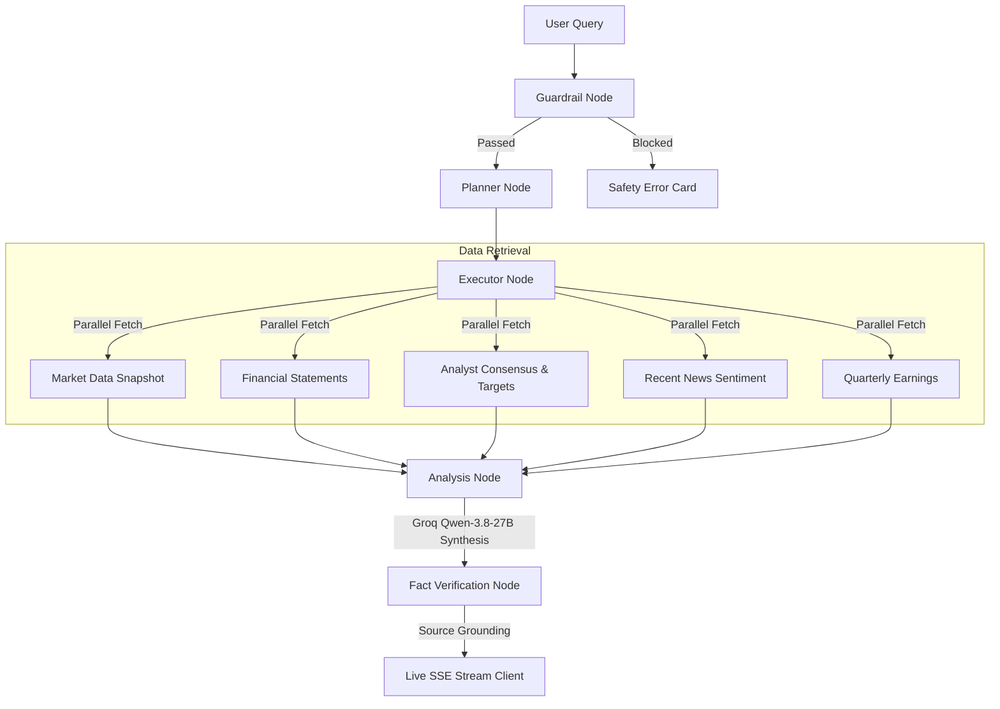

# Research Terminal | Institutional-Grade AI Equity Research Assistant

<p align="center">
  
  
  
  
  
  
  
</p>

---

## Overview

**Research Terminal** is an institutional-grade, multi-agent equity research assistant engineered for rapid financial intelligence and comparative company analysis. Inspired by classic terminal interfaces (Bloomberg Terminal, FactSet, Koyfin), it replaces lengthy, unverified AI chat responses with **structured, real-time financial snapshots, side-by-side valuation cards, and source-grounded investment verdicts**.

Built on a decoupled architecture, the backend orchestrates a multi-node **LangGraph state machine** streaming real-time Server-Sent Events (SSE), while the frontend provides a high-density, responsive **Flutter Web terminal** designed with zero fluff and monospace financial data.

---

## Repository Branch Structure

To maintain clean modular separation between services, this repository is organized into three dedicated branches:

| Branch | Description | Stack |
|---|---|---|
| [`main`](https://github.com/aditya-10k/StockResearchAssistant/tree/main) | **Documentation & Architecture** — Flagship overview, architecture specs, deployment guides. | Markdown |
| [`backend`](https://github.com/aditya-10k/StockResearchAssistant/tree/backend) | **Agentic Pipeline & API** — LangGraph multi-agent workflow, Yahoo Finance services, SSE streaming server. | Python 3.11, FastAPI, LangGraph, Groq, yfinance |
| [`frontend`](https://github.com/aditya-10k/StockResearchAssistant/tree/frontend) | **Financial Terminal Client** — High-density web terminal, BLoC state management, responsive side-by-side comparison. | Flutter Web, Dart, BLoC |

---

## Agentic Architecture

The intelligence pipeline runs on **LangGraph**, executing a multi-stage validation and synthesis graph:



### Pipeline Nodes
1. **Guardrail Node**: Validates that incoming queries pertain to publicly traded securities and financial analysis, filtering unsafe or irrelevant prompts.
2. **Planner Node**: Uses structured LLM outputs to parse company names into verified Yahoo Finance tickers (e.g., `PAYTM.NS`, `NVDA`, `ORCL`) and identifies required service types.
3. **Executor Node**: Concurrently queries Yahoo Finance APIs for live pricing, valuation multiples (P/E, forward P/E, EV/EBITDA, P/B), margins, 52-week price ranges, and analyst consensus.
4. **Analysis Node**: Powered by Groq (`qwen/qwen3.8-27b`) with automatic Gemini fallback. Synthesizes an executive direct verdict, investment thesis, key strengths, and key risks.
5. **Verification Node**: Fact-checks generated statements against retrieved quantitative data to eliminate hallucinations.

---

## Key Features

* **Progressive Real-Time Streaming**: Dispatches node status events (`guardrail` -> `planner` -> `executor` -> `analysis` -> `verification`) via SSE. Market data cards render instantly on the client while the AI verdict is still generating.
* **Responsive Side-by-Side Comparison**: Automatically formats multi-stock queries (`Compare Amazon and Oracle`, `AAPL vs MSFT`) into parallel comparison columns on wide screens.
* **High-Density Financial Cards**: Displays 8 key valuation ratios, 52-week visual range bars, analyst target price upside percentages, and profitability margins.
* **Bloomberg Terminal Aesthetic**: Strict dark palette (`#0C0D12` / `#13151D`), monospace numbers, red/green change pills, and zero emojis.
* **100% Free Cloud Deployment**: Backend deploys on Hugging Face Spaces (Gradio SDK free tier) with native port binding, and the frontend deploys on Firebase Hosting.

---

## Quickstart

### Backend (`git checkout backend`)
```bash
git checkout backend
cd backend

python -m venv .venv
source .venv/bin/activate  # Windows: .venv\Scripts\activate
pip install -r requirements.txt

# Set your API keys in .env
echo "GROQ_API_KEY=your_key_here" > .env
echo "LLM_PROVIDER=groq" >> .env

uvicorn app.main:app --host 0.0.0.0 --port 8000 --reload
```

### Frontend (`git checkout frontend`)
```bash
git checkout frontend
cd frontend

flutter pub get
flutter run -d chrome
```

---

## Deployment

### Backend (Hugging Face Spaces - Free Tier)
1. Create a Space on [Hugging Face](https://huggingface.co/new-space) with SDK **Gradio** (Free 2 vCPU · 16GB).
2. Push the `backend` branch to the Space:
   ```bash
   git push https://huggingface.co/spaces/<YOUR_USERNAME>/<SPACE_NAME> backend:main -f
   ```
3. Set your `GROQ_API_KEY` in the Space **Settings > Secrets**.

### Frontend (Firebase Hosting)
```bash
flutter build web --dart-define=BACKEND_URL=https://<YOUR_USERNAME>-<SPACE_NAME>.hf.space
firebase deploy
```

---

## License

This project is open source and available under the [MIT License](LICENSE).
