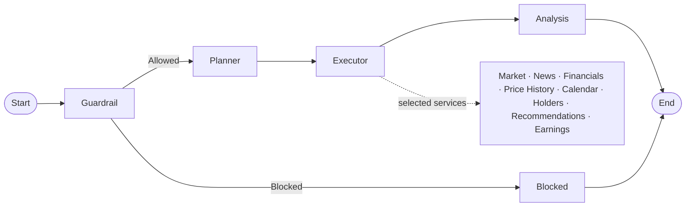

# Stock Research Assistant

A FastAPI and LangGraph backend that researches stocks using `yfinance` and
returns a structured analysis.

## Setup

Add your settings to `.env`:

```env
APP_NAME=Stock Research Assistant
APP_VER=1.0.0
GEMINI_API_KEY=your_key
LLM_PROVIDER=gemini
```

Start the API:

```powershell
.\.venv\Scripts\python.exe -m uvicorn app.main:app --reload
```

## API

- `GET /health` — health check
- `POST /query` — returns the complete result after the graph finishes
- `POST /query/stream` — streams each completed graph node as SSE

Example request:

```json
{
  "query": "I have 1000 Rs. Should I choose Paytm or RVNL?"
}
```

## Graph flow



The planner selects the services needed for a query. The executor retrieves
their data from `yfinance`, and the analysis node creates the final response.

## SSE events

`POST /query/stream` sends events as nodes finish:

```text
guardrail → planner → executor → analysis → done
```

The executor event contains the selected service data.
